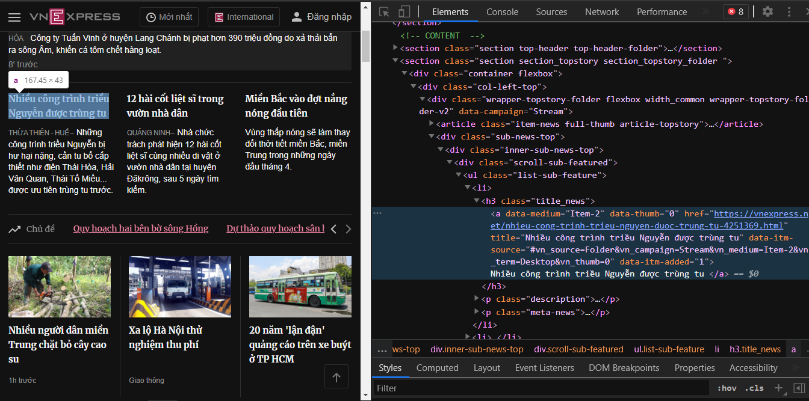

# crawling-VietNam-News
Crawl dữ liệu từ các trang tin tức ở Việt Nam

### Trang web được hỗ trợ crawl
- [VNExpress](http://vnexpress.net/)
- [Việt Nam Net](http://vietnamnet.vn/)
- [Thanh niên](http://thanhnien.vn/)
##### Danh mục : Thời sự, bạn có thể thay đổi danh mục bạn cần dựa vào đường link

# Sử dụng
   - [Cài đặt scarpy](https://docs.scrapy.org/en/latest/intro/install.html)  `pip install Scrapy`
   - Clone git `git clone git://github.com/smoothkt4951/crawling-VietNam-News.git`  
   - Chạy 2 dòng lệnh đầu tiên để cài các module cần thiết, xem [Requirements.txt](Requirements.txt)) hoặc xem hướng dẫn của [newspaper3k](https://pypi.org/project/newspaper3k/)

# Cách mình crawling dữ liệu
 Để có thể thu thập được nhiều trang tin, khi thu thập xong một trang tin tức, ta cần gửi request đến trang tin tức đó một request “next-page” để sang trang kế tiếp và tiếp tục crawl. Mình nên chọn các trang web có cấu trúc ‘next-page’ thay vì scroll xuống để xem tin mới để tiện xử lý url next sang một trang mới. Ví dụ như trang vnexpress.com sẽ có cấu trúc như sau:


 Chữ ‘p2’ trong url trên là trang tin thứ 2, tương tự các trang tin n sẽ có cấu trúc link là `https://vnexpress.net/thoi-su-pn`. Dưới đây là đoạn code mình thực hiện việc tính toán nếu lấy đủ số báo có trong một trang thì thực hiện việc add thêm vào url đó đuôi –pn , kết quả trả về là một danh sách chứa các url của từng trang báo.

```jsx
# VNEXPRESS
def get_page_urls_vnexpress(base_url, quantity):
    news_per_page = 25
    if quantity % news_per_page == 0:
        no_of_pages = quantity // news_per_page
    else:
        no_of_pages = quantity // news_per_page + 1

    extend_url = ['-p{}'.format(page) for page in range(2, no_of_pages + 1)]
    url_list = [base_url + extend_part for extend_part in extend_url]
    url_list.insert(0, base_url)
    return url_list

```
 Mỗi trang báo đều có một cấu trúc url riêng, tương tự trang tin vietnamnet.vn sẽ là `https://vietnamnet.vn/vn/thoi-su/trang2/ và trang tin thanhnien.vn` sẽ là `https://thanhnien.vn/thoi-su/trang-2.html`. Do đó để có thể crawl được nhiều trang báo, bạn sẽ phải xác định được làm sao để gửi một request đến trang kế của trang bạn đang crawl dữ liệu và tiếp tục crawl dữ liệu trên trang kế đó.

 Bước tiếp theo, mình truy cập đến trang bạn cần crawl dữ liệu, sau đó bôi đen một bảng tin và inspect để xem cấu trúc html của nó. Dưới đây là cấu trúc html của một bảng tin trong trang vnexpress:


 
 
 
 Dựa vào đó, bạn sẽ phân tích lần lượt như sau: Thẻ mình cần lấy thông tin (url và title) là thẻ <a>, mỗi thẻ <a> đó sẽ có thẻ <h3> chứa nó và thẻ <section> chứa tất cả các thẻ <h3> trên. Dựa vào phân tích này, ta sẽ lần lượt down html của cả trang, sau đó chỉ chọn các thẻ <section> chứa các thẻ <h3> như trên dựa vào class của nó, tiếp theo là lấy tất cả các thẻ <h3> bên trong thẻ <section> và cuối cùng là tất cả các thẻ <a> mà ta cần tìm. Từ các thẻ <a> này ta sẽ lấy được link cũng như title của từng bài báo có trong trang báo mà ta đang crawl. Đoạn code mình thực hiện việc lấy link và title của trang vnexpress như sau:

```jsx
# VNEXPRESS
def get_links_in_page_vnexpress(url):
    page = urllib.request.urlopen(url)
    soup = BeautifulSoup(page, 'html.parser')
    # <section>
    sections = soup.find_all('section', attrs={'class':'section section_container mt15'})
    # <h3>
    h3_all = []
    for section in sections:
        h3_all.extend(section.find_all('h3', attrs={'class':'title-news'}))
    # <a>
    a_all = []
    results = [[]]
    for h3 in h3_all:
        a_all.extend(h3.find_all('a', attrs={'class':''}))
    for a in a_all:
        title = a.get('title')
        link = a.get('href')
        print('Title: {} - Link: {}'.format(title, link))
        results.append([title,link])
    return results
  ```

 Đoạn code trên trả về một danh sách cái title và link bài báo trong từng trang báo mà bạn crawl. Giờ có link rồi, chỉ cần crawl từng cái link đó về thành file text nữa là xong.
Tuy nhiên cấu trúc html của từng trang báo sẽ khác nhau, có trang đơn giản, có trang phức tạp và tên các class của các thẻ không đồng đều và thay đổi liên tục, do đó việc hiểu được cấu trúc html của trang mà bạn muốn crawl sẽ giúp cho việc bạn crawl dữ liệu chính xác, không nhầm lẫn với các thẻ không cần thiết và tránh việc gọi hàm bs4. find_all() bị trùng lắp các thẻ với nhau.

```jsx
# VIETNAMNET
def get_links_in_page_vietnamnet(url):
    page = urllib.request.urlopen(url)
    soup = BeautifulSoup(page, 'html.parser')
    # <div>
    div_all = soup.find_all('div', attrs={'class':'list-content list-content-loadmore lagre m-t-20 clearfix'})
    div_all

    # <h3>
    h3_all = []
    for div in div_all:
        h3_all.extend(div.find_all('h3', attrs={'class':''}))
    #<a>
    a_all = []
    results = [[]]
    for h3 in h3_all:
        a_all.extend(h3.find_all('a'))
    # print(a_all)
    for a in a_all:
        title = a.get('title')
        link =  'https://vietnamnet.vn/vn/thoi-su'+ str(a.get('href'))
        print('Title: {} - Link: {}'.format(title, link))
        results.append([title,link])
    return results
```
 Một ví dụ đối với trang vietnamnet.vn, thẻ <a> của họ có attribute href thiếu mất domain, bạn phải cộng thể chuỗi 'https://vietnamnet.vn/vn/thoi-su' vào đường link trong href mới có được url hoàn chỉnh.


 Sau khi có được các link và title, giờ chỉ việc lần lượt crawl từng trang html về, sau đó tiến hành ghi ra file kết quả là xong. Mọi công việc crawl này bạn có thể sử dụng thư viện Acticle của newspaper:
```jsx
def crawl_by_url(url, title):
    article = Article(url, language='vi')
    article.download()
    article.parse()
    contents = str(article.text).replace("\n","")
    article.nlp()
    # replace
    char_to_replace = {':': '',
                       '/': '',
                       '\\': '',
                      '*': '',
                      '?': '',
                      '"': '',
                      '<': '',
                      '>': '',
                      '|': ''}
    for key, value in char_to_replace.items():
        # Replace key character with value character in string
        title = title.replace(key, value)

    # write txt
    # https://vnexpress.net
    if(url.find('https://vnexpress.net/') != -1):
        output = "data/text/vnexpress/" + title  + ".txt"
        f = open(output, "w+", encoding='utf-8')
        f.write(str(url)+"\n")
        f.write(title+"\n")
        f.write(contents)
        f.close()
    elif(url.find('https://thanhnien.vn/') != -1):
        output = "data/text/thanhnien/" + title  + ".txt"
        f = open(output, "w+", encoding='utf-8')
        f.write(str(url)+"\n")
        f.write(title+"\n")
        f.write(contents)
    elif(url.find('https://vietnamnet.vn/') != -1):
        output = "data/text/vietnamnet/" + title  + ".txt"
        f = open(output, "w+", encoding='utf-8')
        f.write(str(url)+"\n")
        f.write(title+"\n")
        f.write(contents)
```
 Ở đây mình sẽ lưu file với tên là title của trang báo, lưu ý rằng tên file không được chứa các ký tự đặc biệt, do đó mình có một đoạn code nhỏ thực hiện việc replace các ký tự đặc biệt thành null rồi mới tiến hành ghi file để tránh trường hợp lỗi khi ghi file với tên file chứa ký tự đặc biệt.


         
 
                  
                  


